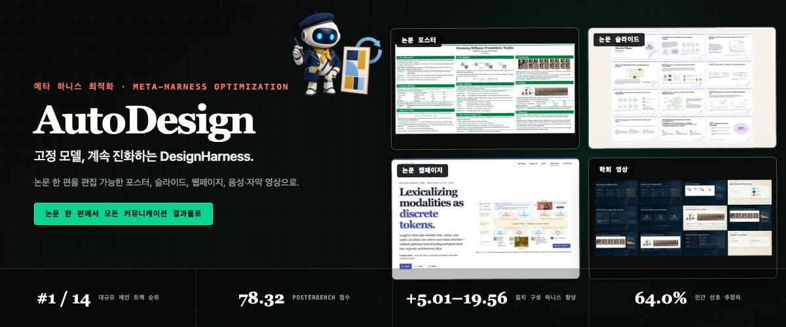
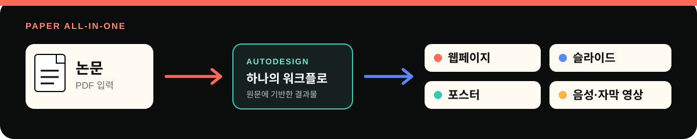

<p align="center">
  <a href="./README.md">English</a> ·
  <a href="./README.zh-CN.md">简体中文</a> ·
  <strong>한국어</strong>
</p>

<p align="center">
  
</p>

<h1 align="center">AutoDesign: Meta-Harness Optimization for Long-Horizon Agentic Design</h1>

<p align="center">
  고정 모델 주위에 재사용 가능한 DesignHarness를 학습하고, 논문 한 편을 편집 가능한 포스터, 슬라이드, 웹페이지, 음성·자막 영상으로 변환합니다.
</p>

<p align="center">
  <a href="https://arxiv.org/abs/2608.13560"><kbd>논문 · arXiv:2608.13560 ↗</kbd></a>
  &nbsp;&nbsp;·&nbsp;&nbsp;
  <a href="https://huggingface.co/datasets/YaxinLuo/PosterBench"><kbd>데이터셋 · PosterBench ↗</kbd></a>
  &nbsp;&nbsp;·&nbsp;&nbsp;
  <a href="https://huggingface.co/datasets/YaxinLuo/PosterBench-mini"><kbd>데이터셋 · PosterBench-mini ↗</kbd></a>
</p>

<p align="center">
  <a href="https://autodesign.designanything.ai/"><strong>✦ AutoDesign 이야기 살펴보기 ↗</strong></a>
  &nbsp;&nbsp;·&nbsp;&nbsp;
  <a href="https://designanything.ai/"><strong>데모 페이지 열기 ↗</strong></a>
</p>

<p align="center">
  <a href="#user-content-demos"><strong>Demo</strong></a> ·
  <a href="#user-content-quickstart">빠른 시작</a> ·
  <a href="#user-content-paper-suite">논문 패키지</a> ·
  <a href="#user-content-methodology">방법론</a> ·
  <a href="#user-content-benchmark">PosterBench</a> ·
  <a href="#user-content-human-evaluation">인간 평가</a> ·
  <a href="#user-content-interfaces">출력</a>
</p>

<a id="demos"></a>

##  AutoDesign for AutoDesign · 논문 한 편 → 네 가지 결과물

아래 결과물은 목업이 아니라 실제 생성 결과입니다. AutoDesign은 자체 논문을 논문의
Figure 2 포스터, 24장짜리 정식 학술 발표 자료, 완전한 에디토리얼 연구 웹페이지,
6분 분량의 1080p 학회 영상으로 직접 만들었습니다.

<table width="100%">
  <tr>
    <td width="50%" valign="top">
      <a href="./assets/readme/demo/artifacts/autodesign-for-autodesign-poster.pdf"></a><br>
      <strong>포스터 · AutoDesign</strong><br>
      논문 Figure 2: AutoDesign이 자기 시스템을 위해 만든 정보 밀도가 높고 편집 가능한 학술 포스터입니다.<br>
      <a href="./assets/readme/demo/artifacts/autodesign-for-autodesign-poster.pdf"><strong>전체 포스터 PDF 열기 ↗</strong></a>
    </td>
    <td width="50%" valign="top">
      <a href="./assets/readme/demo/artifacts/autodesign-slides-formal-academic.pdf"></a><br>
      <strong>슬라이드 · AutoDesign</strong><br>
      AutoDesign이 자체 시스템을 위해 생성한 24장짜리 정식 학술 발표 자료입니다.<br>
      <a href="./assets/readme/demo/artifacts/autodesign-slides-formal-academic.pdf"><strong>전체 슬라이드 PDF 열기 ↗</strong></a>
    </td>
  </tr>
  <tr>
    <td width="50%" valign="top">
      <a href="./assets/readme/demo/artifacts/autodesign-landing-page.html"></a><br>
      <strong>웹페이지 · AutoDesign</strong><br>
      논문의 방법, 근거, 결과, 한계를 인터랙티브한 이야기로 구성한 에디토리얼 연구 페이지입니다.<br>
      <a href="./assets/readme/demo/artifacts/autodesign-landing-page.html"><strong>전체 랜딩 페이지 다운로드 ↗</strong></a>
    </td>
    <td width="50%" valign="top">
      <a href="./assets/readme/demo/artifacts/autodesign-conference-video-6min.mp4"></a><br>
      <strong>영상 · AutoDesign</strong><br>
      Meta-Harness Optimization, DesignHarness, PosterBench를 소개하는 6분 분량의 1080p 학회 영상입니다.<br>
      <a href="./assets/readme/demo/artifacts/autodesign-conference-video-6min.mp4"><strong>MP4 시청하기 ↗</strong></a>
    </td>
  </tr>
</table>

<a id="quickstart"></a>

##  로컬에서 시작하기

###  명령 한 번으로 로컬 실행

필수 조건: Node.js 22+, `ffmpeg`/`ffprobe`.

```bash
curl -fsSL https://designanything.ai/install.sh | bash
autodesign start
```

런처는 `~/.local/share/autodesign` 아래에 설치되고, 상태는 `~/.autodesign`에 보관되며, 번들된 `web/dist`를 제공한 뒤 브라우저를 엽니다. 설치된 런타임은 `autodesign doctor`로 확인할 수 있습니다. 기존 `~/.designanything` 상태는 호환성 심볼릭 링크와 함께 마이그레이션됩니다. 호스팅 엔드포인트를 사용할 수 없다면 아래의 소스 실행 방법을 사용하세요.

###  소스에서 실행

요구 사항: Python 3.10+, [`uv`](https://docs.astral.sh/uv/), Node.js 22+,
npm, Video 생성을 위한 `ffmpeg`/`ffprobe`.

#### 1. 설치

```bash
uv sync
uv run python scripts/install_playwright_browsers.py
cd runtime/video && npm ci --omit=dev
cd ../../web && npm install
```

Provider 키는 `.env`에 설정하거나 Web UI의 Settings 패널에 입력하세요. 업데이트할 때 기존 `.env`를 덮어쓰지 마세요.

#### 2. Workbench 실행

백엔드를 시작합니다.

```bash
uv run uvicorn scripts.web_server:app --reload --port 8000
```

다른 터미널에서 프런트엔드를 시작합니다.

```bash
cd web
npm run dev
```

[localhost:5173](http://localhost:5173)을 여세요. 백엔드 상태는 [`/api/health`](http://127.0.0.1:8000/api/health)에서 확인할 수 있습니다.

PDF 한 편을 업로드하고 **Paper All-in-One**을 선택하면 포스터, 슬라이드, 웹페이지, 음성 내레이션 영상 Track이 함께 시작됩니다.

#### 3. 논문 포스터 생성

```bash
uv --cache-dir .uv-cache run python -m autodesign run \
  "Create a dense academic conference poster from the attached paper." \
  --from-file /absolute/path/to/paper.pdf \
  --template cvpr-landscape
```

`final/poster.html`, `final/preview.png`, 최종 Manifest, `run_events.jsonl`을 확인하세요. 폴백 이후에도 파일이 존재할 수 있으므로, 터미널 상태와 검증 피드백 역시 결과의 일부입니다.

<details>
<summary><strong>시각적 참조 자료 사용하기</strong></summary>

```bash
uv --cache-dir .uv-cache run python -m autodesign run \
  "Create a paper poster using the reference's visual system." \
  --from-file /absolute/path/to/paper.pdf \
  --reference-poster /absolute/path/to/reference.png
```

참조 포스터에서는 시각 시스템만 이전합니다. 참조 자료의 텍스트, 주장, 로고, QR 코드, 그림, 표, 링크는 논문 내용의 근거가 되지 않습니다.

</details>

<a id="paper-suite"></a>

##  논문 한 편으로, 다음에 필요한 모든 결과물을

<p align="center">
  
</p>

논문은 한 번만 완성하면 됩니다. **Paper All-in-One**은 같은 원문을 바탕으로 그다음에 필요한 모든 결과물을 패키지로 만듭니다. 홍보용 웹페이지, 학회 발표 슬라이드, 학술 포스터, 음성 내레이션과 시간 동기화 자막이 포함된 영상까지, 형식마다 논문의 이야기를 처음부터 다시 구성할 필요가 없습니다.

<p align="center">
  <a href="https://designanything.ai/"><strong>완전한 논문 커뮤니케이션 패키지 생성하기 ↗</strong></a>
</p>

##  AutoDesign 실행 과정 보기

로컬 사용 가이드를 따라 Workbench를 구성하고, Paper All-in-One을 실행하고, 진행 상황을
확인한 뒤 각 편집 가능한 캔버스로 들어가 보세요. [온라인 Demo](https://designanything.ai/)에서
먼저 사용해 볼 수도 있으며, 가장 완전하고 안정적인 경험을 위해서는 AutoDesign을 로컬에
설치하는 것을 권장합니다.

<p align="center">
  <strong>로컬 사용 가이드 · Paper All-in-One → 편집 가능한 캔버스</strong>
</p>

https://github.com/user-attachments/assets/69c25973-fedf-4273-aa33-6bd3e409c692

<details>
<summary><strong>학술 포스터 갤러리 열기</strong></summary>
<br>

<p align="center"><strong>Claude 4.8 저작 경로</strong></p>

<p align="center">
  
  
  
</p>

<p align="center"><strong>Codex GPT-5.5 xhigh 저작 경로</strong></p>

<p align="center">
  
  
  
</p>

</details>

##  AutoDesign을 선택하는 이유

- **논문 이후의 전체 여정을 하나의 워크플로로.** 같은 원문에서 홍보용 웹페이지, 발표 슬라이드, 학회 포스터, 음성·자막 영상을 만들기 때문에 네 번 다시 시작할 필요가 없습니다.
- **기본적으로 편집 가능.** HTML, 네이티브 텍스트, 표, 이름이 지정된 에셋을 하나의 이미지로 평면화하지 않고 계속 수정할 수 있습니다.
- **원문 근거 기반.** 주장, 그림, 표의 출처가 실행 결과와 함께 보존됩니다. 참조 자료에서는 스타일만 이전할 수 있으며, 내용의 근거를 가져오지 않습니다.
- **모델 가중치가 아니라 시스템을 최적화.** 완전한 실행 궤적에서 반복되는 실패를 찾고, 메타 하니스 최적화로 재사용 가능한 DesignHarness 구성 요소를 한 번에 하나씩 개선합니다.
- **검사 가능하고 로컬 우선.** 이벤트, Manifest, 후보 결과, 검증 피드백, 최종 파일이 사용자의 컴퓨터에 남습니다.

<a id="methodology"></a>

##  방법: 메타 하니스 최적화

**디자인 하니스(design harness)** 는 고정된 LLM 또는 MLLM 주위에서 멀티모달 소스를 사람이 이해하고 수정할 수 있는 결과물로 바꾸는 시스템이며, 그 과정은 실행 궤적으로 기록됩니다. **메타 하니스(meta-harness)** 는 이 주변 시스템 자체를 개선합니다. 따라서 AutoDesign은 기본 모델의 가중치를 고정한 채 완전한 rollout에서 학습합니다. 자율 최적화 전에 evaluator coding agent는 일곱 가지 품질 차원에 대해 사람이 주석을 단 참조 결과물을 사용해 고정된 최적화용 evaluator를 구현합니다. 이 evaluator는 규칙 기반 검사와 VLM 판단을 결합하며, 최종 시스템 비교에 쓰이는 고정 PosterBench 프로토콜과는 별개입니다.

<p align="center">
  
</p>

<p align="center">
  
</p>

자율 outer-loop iteration은 rollout, evaluation, 단일 구성 요소 update
proposal, acceptance를 거쳐 DesignHarness를 진화시킵니다. 자율 최적화가
정체기에 도달하면 선택적인 Human-in-the-loop 지침으로 탐색 방향을 바꾸고
production poster 품질을 더 높일 수 있습니다.

###  두 개의 중첩 피드백 루프

| 루프 | 개선 대상 | 근거와 업데이트 |
|---|---|---|
| **내부 루프 · 결과물 생성** | 고정된 디자인 하니스 아래의 하나의 편집 가능한 결과물 | **Designer**가 결과물을 수정하고 **Critic**이 피드백을 반환하며, 이 상호작용이 실행 궤적을 이룹니다 |
| **외부 루프 · 하니스 최적화** | 여러 작업에서 재사용되는 디자인 하니스 | **MetaHarnessOptimizer**가 실행 궤적, 평가 점수, 지속적인 최적화 기록, 선택적인 사람의 지침을 분석합니다 |

각 외부 반복은 **rollout → evaluation → update proposal → acceptance** 네 단계로 진행됩니다. Optimizer는 planner와 code editor 역할을 순차적으로 수행하고, 한 번에 정확히 하나의 하니스 구성 요소만 업데이트합니다. 학습 성능이 향상되고 독립 development set의 성능이 하락하지 않을 때만 후보를 채택하며, development 궤적은 업데이트 제안자에게 공개하지 않습니다.

<p align="center">
  
</p>

Human-in-the-loop 지침은 선택 사항입니다. 사용자는 planner에 관찰이나 상위 수준의 방향을 제공해 정체된 탐색을 전환할 수 있고, 체계적인 평가기 편향을 수정하려면 명시적인 사람의 입력이 필요합니다. 지침이 없으면 외부 루프는 자율적으로 실행됩니다.

###  디자인 하니스의 다섯 구성 요소

| 구성 요소 | 메타 하니스가 최적화하는 요소 |
|---|---|
| **Context and Memory** | 멀티모달 소스 관리, 작업 프롬프트, Skills, 재사용 에셋, 수정 시도 사이에 유지되는 상태 |
| **Tools and Specifications** | 레이아웃, 타이포그래피, provenance를 위한 도구와 편집 가능한 결과물 명세 |
| **Execution Runtime** | 저작, 렌더링, 검증, 내보내기를 위한 작업 공간과 런타임 |
| **Orchestration** | 작업 라우팅, 시도 예산, 루프 제어, 후보 선택, fallback, finalization |
| **Evaluation and Feedback** | 규칙 기반 검증, 모델 기반 비평, 수정을 위한 국소 피드백 |

###  최적화된 DesignHarness

메타 하니스 최적화는 재사용 가능한 결과물 생산 시스템 **DesignHarness**를 만듭니다. 이 시스템은 **소스 수집, 반복적 결과물 생성과 수정, 이중 Critic 검증, finalization**의 네 단계로 구성됩니다. 논문 메타데이터, 주장, 그림, 표, 소스 위치는 provenance-aware 컨텍스트가 되고, coding-agent Designer는 네이티브 HTML을 직접 편집합니다. 규칙 기반 validator와 VLM Critic이 국소 피드백을 반환한 뒤 최상의 유효 후보를 독립 실행 가능한 결과물로 만듭니다.

현재 구현은 최대 12회의 수정 시도를 허용합니다. 차단 검사는 안전하지 않거나 누락된 에셋, 끊어진 provenance, 심각한 overflow 또는 overlap, 필수 타이포그래피와 레이아웃 제약을 다룹니다. 예산 안에 통과한 후보가 없으면 저장된 시도 기록을 이용해 제한된 fallback을 적용한 후 동일한 finalization 단계로 보냅니다.

<p align="center">
  
</p>

<p align="center">
  
</p>

최신 논문은 한 번의 포스터 실행에서 선택한 다섯 시도도 추적합니다. Critic은
A1에서 잘린 분석 영역을 찾고, A3는 전체 fit을 복원하며, A5는 헤더를 다시
맞추고, A6는 시각적 근거를 확대합니다. A9는 복구된 구성을 유지해 최종
채택됩니다. 이 궤적은 진단이 국소 수정을 이끌면서도 유효한 레이아웃과
원문 기반 콘텐츠를 후속 수정에서 보존함을 보여 줍니다.

<a id="benchmark"></a>

##  PosterBench 리더보드

**PosterBench**는 논문 100편의 대규모 세트와 고정된 논문 10편의 소규모 세트를 포함합니다. AI/ML, 생의학과 건강, 기후와 지구 환경, 경제와 정책, 물리와 천문학의 다섯 분야를 다루며, 모든 시스템 출력은 채점 전에 공통 포스터 형식으로 렌더링됩니다.

메타데이터 전용 benchmark manifest는 Hugging Face의
[`YaxinLuo/PosterBench`](https://huggingface.co/datasets/YaxinLuo/PosterBench)와
[`YaxinLuo/PosterBench-mini`](https://huggingface.co/datasets/YaxinLuo/PosterBench-mini)에
공개되어 있습니다. 원문 논문 PDF를 재배포하지 않고 직접 다운로드하거나
`datasets`로 불러올 수 있습니다.

일곱 차원은 **Faithfulness, Coverage, Density, Visual Evidence, Layout, Readability, Aesthetics**이며 가중치는 **10/10/15/10/20/25/10**입니다. 프로그램 기반 근거와 원문 조건부 VLM 판단을 먼저 집계한 다음, 심각한 레이아웃 손상, 부족한 presentation viability, 확인된 가시적 실패, 보호된 render integrity 가운데 가장 엄격한 활성 점수 상한을 각 포스터에 적용합니다.

<p align="center">
  
</p>

###  Full-Scale Benchmark Main Track · 논문 100편

AutoDesign은 PosterBench에서 가장 높은 두 점수를 기록합니다. Claude Code와 Claude 4.8을 고정하면 **78.32점**으로 Claude Design보다 **7.45점**, OpenDesign보다 **8.87점** 높습니다.

<p align="center">
  
</p>

| 순위 | 점수 | 시스템 | Design harness | Coding agent | 모델 |
|---:|---:|---|---|---|---|
| **1** | **78.32** | **AutoDesign** | **DesignHarness** | **Claude Code** | **Claude 4.8** |
| **2** | **77.97** | **AutoDesign** | **DesignHarness** | **Codex** | **GPT-5.5** |
| 3 | 73.37 | Codex | — | Codex | GPT-5.5 |
| 4 | 70.87 | Claude Design | Claude Design | Claude Code | Claude 4.8 |
| 5 | 70.01 | Claude Code | — | Claude Code | Claude 4.8 |
| 6 | 69.45 | OpenDesign | OpenDesign | Claude Code | Claude 4.8 |
| 7 | 62.17 | OpenDesign | OpenDesign | Codex | GPT-5.5 |
| 8 | 61.14 | Doubao | — | Claude Code | Seed 2.1 |
| 9 | 56.71 | PosterGen | — | — | Claude 4.8 |
| 10 | 52.22 | GLM | — | Claude Code | GLM 5.2 |
| 11 | 51.46 | Kimi | — | Claude Code | Kimi K2.7 |
| 12 | 49.09 | Any2Poster | — | — | Claude 4.8 |
| 13 | 46.01 | DeepSeek | — | Claude Code | DeepSeek V4 Pro |
| 14 | 44.61 | Paper2Poster | — | — | Claude 4.8 |

<details>
<summary><strong>Small-Scale Benchmark Main Track 열기 · 고정 10편 하위 집합</strong></summary>
<br>

| 순위 | 점수 | 시스템 | Design harness | Coding agent | 모델 |
|---:|---:|---|---|---|---|
| **1** | **81.46** | **AutoDesign** | **DesignHarness** | **Codex** | **GPT-5.5** |
| 2 | 75.87 | Codex | — | Codex | GPT-5.5 |
| **3** | **74.56** | **AutoDesign** | **DesignHarness** | **Claude Code** | **Claude 4.8** |
| 4 | 70.36 | OpenDesign | OpenDesign | Claude Code | Claude 4.8 |
| 5 | 69.55 | Claude Code | — | Claude Code | Claude 4.8 |
| 6 | 66.83 | Claude Design | Claude Design | Claude Code | Claude 4.8 |
| 7 | 60.58 | OpenDesign | OpenDesign | Codex | GPT-5.5 |
| 8 | 57.20 | Kimi | — | Claude Code | Kimi K2.7 |
| 9 | 54.01 | Doubao | — | Claude Code | Seed 2.1 |
| 10 | 51.82 | PosterGen | — | — | Claude 4.8 |
| 11 | 50.32 | GLM | — | Claude Code | GLM 5.2 |
| 12 | 46.88 | Any2Poster | — | — | Claude 4.8 |
| 13 | 42.06 | Paper2Poster | — | — | Claude 4.8 |
| 14 | 34.73 | DeepSeek | — | Claude Code | DeepSeek V4 Pro |

</details>

###  Controlled Track · 고정 10편 하위 집합

각 Controlled Track은 다른 요인을 고정하고 하나의 요인만 변경합니다.

| 순위 | Design Harness Track<br><sub>고정: Claude Code + Claude 4.8</sub> | 점수 | Coding Harness Track<br><sub>고정: AutoDesign + GLM 5.2</sub> | 점수 | Model Track<br><sub>고정: AutoDesign + Claude Code</sub> | 점수 |
|---:|---|---:|---|---:|---|---:|
| **1** | **AutoDesign** | **74.56** | **Kimi Code** | **82.31** | **Claude 4.8** | **74.56** |
| 2 | OpenDesign | 70.36 | ZCode | 69.53 | Seed 2.1 Pro | 71.83 |
| 3 | Claude Design | 66.83 | OpenCode | 67.87 | Kimi K2.7 | 70.12 |
| 4 | — | — | Claude Code | 64.33 | GLM 5.2 | 64.33 |
| 5 | — | — | — | — | LongCat 2.0 | 55.13 |
| 6 | — | — | — | — | DeepSeek V4 Pro | 54.29 |

###  DesignHarness 효과

모델과 coding agent를 일치시킨 일곱 구성 모두에서 DesignHarness를 연결하면 PosterBench Score가 **+5.01~+19.56점** 향상됩니다. 네이티브 Codex–GPT-5.5는 **75.87에서 81.46(+5.59)**으로, Claude Code–Kimi K2.7은 **57.20에서 70.12(+12.92)**로 상승합니다. 가장 큰 향상은 Claude Code–DeepSeek V4 Pro의 **+19.56점**입니다.

<p align="center">
  
</p>

###  비용–성능 절충

고정된 10편 하위 집합에서 관찰한 Pareto frontier는 LongCat 2.0(**55.13, 포스터당 $0.27**)에서 Doubao Seed 2.1 Pro(**71.83, $2.75**)와 Claude 4.8(**74.56, $7.63**)을 거쳐 GPT-5.5(**81.46, $10.02**)로 이어집니다. Doubao는 GPT-5.5의 정규화된 designer-only API 비용의 27%로 88%의 점수를 달성합니다.

<p align="center">
  
</p>

실행 가능한 프로토콜, 데이터 준비, 채점 책임, 레코드별 점수 상한, 재현 명령은 [PosterBench 평가 가이드](eval/README.ko.md)를 참고하세요.

<a id="human-evaluation"></a>

##  인간 평가

완전히 시스템 정보를 가린 연구에서 **11명의 자원 평가자**가 **936개의 응답**을 제출했습니다. 933개의 순위 판단과 세 번의 건너뛰기로 구성됩니다. AutoDesign의 Bradley–Terry 추정치는 **64.0%**로 가장 높고, 95% 구간은 **55.2–77.8%**입니다. 동점을 보정한 경험적 선호도는 Claude Code 대비 61.3%, OpenDesign 대비 63.1%, Claude Design 대비 67.6%입니다.

<p align="center">
  
</p>

PosterBench는 인간 선호와 양의 관계를 보이지만 완전히 동일하지는 않습니다(**r = 0.34**, 95% 구간 **0.22–0.44**). 0–3점 차이에서는 사람이 PosterBench 선호 방향에 동의하는 비율이 **51.9%**이고, 점수 차이가 20점 이상이면 **74.4%**로 높아집니다.

<p align="center">
  
</p>

##  향후 방향

현재 DesignHarness는 이미 **paper-to-slide, paper-to-webpage, paper-to-conference-video** 파일럿을 생성하지만, PosterBench가 공식적으로 검증하는 대상은 학술 포스터뿐입니다. 슬라이드, 웹페이지, 영상은 포스터 파이프라인과 같은 연구 검증 수준에 도달하려면 매체별 source–output 데이터, evaluator, rendering/validation gate, 매체별 communication objective가 더 필요합니다.

<p align="center">
  
</p>

장기적으로 AutoDesign은 논문, 시각적 근거, 코드, 데이터, 사람의 지침을 통합해 매체에 맞는 결과물을 만드는 multimodal-in, multimodal-out 에이전틱 디자인을 목표로 합니다. 더 나은 구성 요소 선택, 고정된 참조 작업과 사람의 감사에 기반한 evaluator evolution, 하니스 최적화와 모델 post-training의 결합은 여전히 열린 연구 문제입니다.

<p align="center">
  
</p>

새로운 디자인 하니스, 개선 워크플로, 평가기, 결과물 기능을 만드는 연구자, 디자이너, 엔지니어의 기여를 환영합니다.

<p align="center">
  <a href="https://github.com/Yaxin9Luo/AutoDesign"><strong>GitHub에서 기여하기 ↗</strong></a> ·
  <a href="https://autodesign.designanything.ai/"><strong>프로젝트 살펴보기 ↗</strong></a>
</p>

<a id="interfaces"></a>

##  인터페이스와 출력

Web UI는 Paper All-in-One 생성, 모델 및 제공자 설정, 진행 상황 스트리밍, 취소와 재시도, 서버 기반 기록, 지원되는 HTML-first 결과물의 직접 편집 기능을 제공합니다.

대화형 CLI를 시작합니다.

```bash
uv --cache-dir .uv-cache run python -m autodesign
```

| 사용 사례 | 주요 출력 |
|---|---|
| 학술 논문 포스터 | `final/poster.html`, `final/preview.png`, 선택적 PDF |
| 슬라이드 덱 | `final/deck.html`, `final/deck.pdf`, 슬라이드 미리보기 |
| 랜딩 또는 프로젝트 페이지 | `final/index.html`, `final/preview.png` |
| 영상 | 편집 가능한 HyperFrames 프로젝트, AAC 오디오가 포함된 음성 내레이션 MP4, 스크립트, 시간 동기화 SRT/VTT 자막 |
| 크리에이티브 포스터 | HTML/PNG, 지원되는 경우 기존 PSD/SVG 경로 |
| 연구 재현 인계 | OpenResearch 프로젝트, 세션, 리포트 링크 |

단일 실행 출력은 `out/runs/<run_id>/`에, EvaData 배치 출력은 `out/eva_poster_batches/<batch_id>/`에 저장됩니다. 두 위치 모두 Git에서 제외됩니다.

표준 Python 모듈과 설치 런처는 `autodesign`입니다. `design_anything` 모듈, `design-anything` 콘솔 명령, `designanything` 런처, `DESIGN_ANYTHING_*` 환경 변수는 더 이상 권장되지 않는 호환성 별칭입니다. 새로운 설정과 자동화에서는 `AUTODESIGN_*`를 사용하세요.

##  감사의 말

AutoDesign은 오픈소스 커뮤니티의 오랜 작업 위에 세워졌습니다. 특히 다음 프로젝트에 감사드립니다:

- [HyperFrames](https://github.com/heygen-com/hyperframes): HTML-first 비디오
  런타임, 컴포지션 lint, MP4 렌더링을 제공합니다.
- [KaTeX](https://katex.org/): 이식 가능한 HTML 결과물에서 오프라인 수식
  조판을 가능하게 합니다.
- [html-ppt-skill](https://github.com/lewislulu/html-ppt-skill): 이 저장소에
  적용한 MIT 라이선스 슬라이드 저작 참조 에셋을 제공합니다.

##  라이선스

MIT. 번들된 서드파티 에셋에는 각 에셋의 라이선스가 적용됩니다.
자세한 내용은 [서드파티 고지](./THIRD_PARTY_NOTICES.md)를 참조하세요.
