<p align="center">
  <strong>English</strong> ·
  <a href="./README.zh-CN.md">简体中文</a> ·
  <a href="./README.ko.md">한국어</a>
</p>

### News

| Date | Update |
| :--- | :--- |
| **2026-08-19** | [Poster canvas controls: prompt-first templates, aspect ratios, and exact pixel sizes, plus academic presets in the Web UI](https://github.com/Yaxin9Luo/AutoDesign/compare/51dc4212c86f850bb7915d0e1e7096c1a29cd040...55b18da6bff0e541e6d204c525b0f9d715fc17da) |
| **2026-08-19** | [Agent Skills v0.2.0: Poster Agent-first PDF ingestion and white primary canvases across all four Skills](./agent_skills/README.md#agent-skills-v0-2-0) |
| **2026-08-18** | [Poster Skill Agent-first v2: direct PDF curation, revision-bound attempts, and read-only DOM QA](./agent_skills/README.md#poster-agent-first-v2) |
| **2026-08-17** | [Standalone Agent Skills for Poster, PPT, Webpage, and Video are now installable](./agent_skills/README.md) |
| **2026-08-15** | [Added official DeepSeek Harness support for coding agents](https://github.com/Yaxin9Luo/AutoDesign/pull/2) |
| **2026-08-14** | [Initial public release](https://github.com/Yaxin9Luo/AutoDesign/commit/55586f66fa4a126997f0d252e070701c4ae68920) |

<p align="center">
  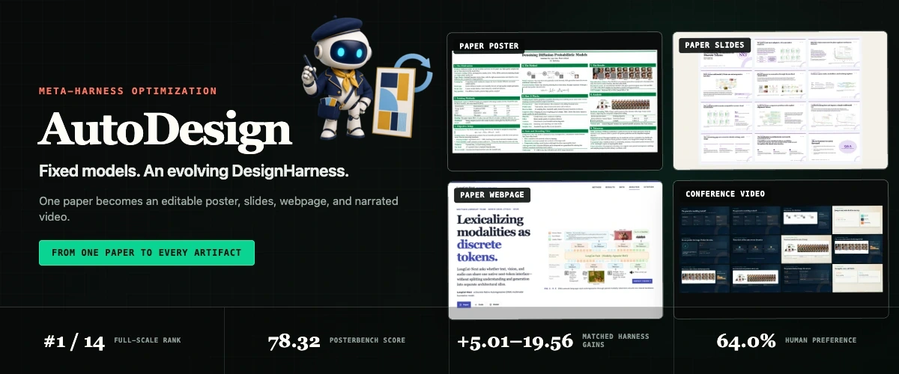
</p>

<h1 align="center">AutoDesign: Meta-Harness Optimization for Long-Horizon Agentic Design</h1>

<p align="center">
  Learn a reusable DesignHarness around fixed models, then turn one paper into an editable poster, slides, webpage, and narrated + captioned video.
</p>

<p align="center">
  <a href="https://arxiv.org/abs/2608.13560"><kbd>Paper · arXiv:2608.13560 ↗</kbd></a>
  &nbsp;&nbsp;·&nbsp;&nbsp;
  <a href="https://huggingface.co/datasets/YaxinLuo/PosterBench"><kbd>Dataset · PosterBench ↗</kbd></a>
  &nbsp;&nbsp;·&nbsp;&nbsp;
  <a href="https://huggingface.co/datasets/YaxinLuo/PosterBench-mini"><kbd>Dataset · PosterBench-mini ↗</kbd></a>
</p>

<p align="center">
  <a href="https://autodesign.designanything.ai/"><strong>✦ Explore the AutoDesign story ↗</strong></a>
  &nbsp;&nbsp;·&nbsp;&nbsp;
  <a href="https://designanything.ai/"><strong>Open the Demo Page ↗</strong></a>
</p>

<p align="center">
  <a href="#user-content-demos"><strong>Demos</strong></a> ·
  <a href="#user-content-agent-skills">Agent Skills</a> ·
  <a href="#user-content-quickstart">Quickstart</a> ·
  <a href="#user-content-paper-suite">Paper Suite</a> ·
  <a href="#user-content-methodology">Methodology</a> ·
  <a href="#user-content-benchmark">PosterBench</a> ·
  <a href="#user-content-human-evaluation">Human Evaluation</a> ·
  <a href="#user-content-interfaces">Outputs</a>
</p>

<a id="demos"></a>

##  AutoDesign for AutoDesign · One Paper → Four Artifacts

These are real outputs, not mockups. AutoDesign turned its own paper into the
paper's Figure 2 poster, a 24-slide formal academic talk, a complete editorial
research webpage, and a six-minute 1080p conference video.

<table width="100%">
  <tr>
    <td width="50%" valign="top">
      <a href="./assets/readme/demo/artifacts/autodesign-for-autodesign-poster.pdf">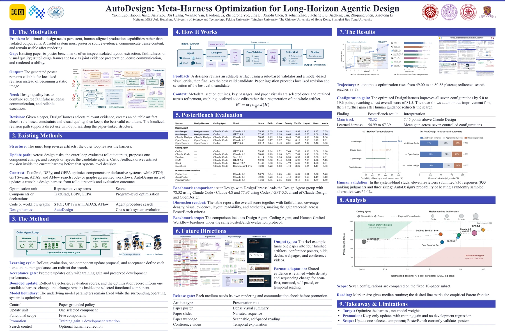</a><br>
      <strong>Poster · AutoDesign</strong><br>
      Figure 2 of the paper: an information-dense, editable academic poster made by AutoDesign for itself.<br>
      <a href="./assets/readme/demo/artifacts/autodesign-for-autodesign-poster.pdf"><strong>Open full poster PDF ↗</strong></a>
    </td>
    <td width="50%" valign="top">
      <a href="./assets/readme/demo/artifacts/autodesign-slides-formal-academic.pdf">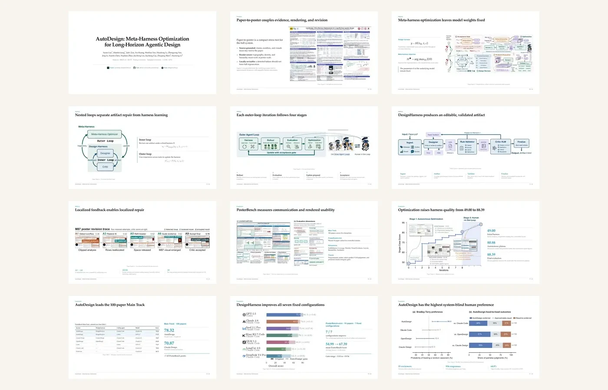</a><br>
      <strong>Slides · AutoDesign</strong><br>
      A complete 24-slide formal academic conference talk made by AutoDesign for itself.<br>
      <a href="./assets/readme/demo/artifacts/autodesign-slides-formal-academic.pdf"><strong>Open full slide deck PDF ↗</strong></a>
    </td>
  </tr>
  <tr>
    <td width="50%" valign="top">
      <a href="./assets/readme/demo/artifacts/autodesign-landing-page.html">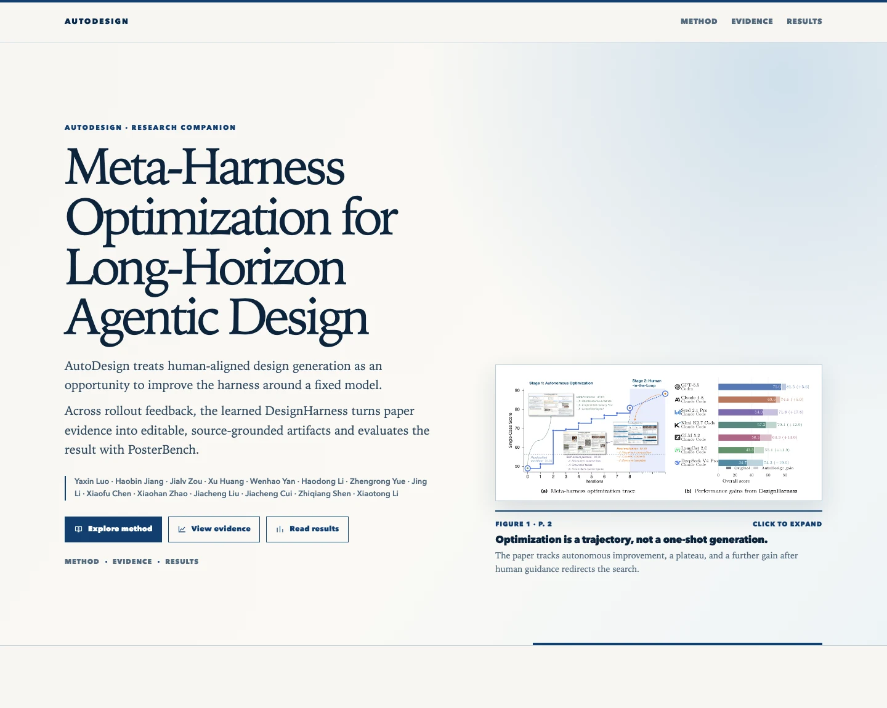</a><br>
      <strong>Webpage · AutoDesign</strong><br>
      An editorial research experience that turns the paper's method, evidence, results, and limitations into an interactive story.<br>
      <a href="./assets/readme/demo/artifacts/autodesign-landing-page.html"><strong>Download full landing page ↗</strong></a>
    </td>
    <td width="50%" valign="top">
      <a href="./assets/readme/demo/artifacts/autodesign-conference-video-6min.mp4">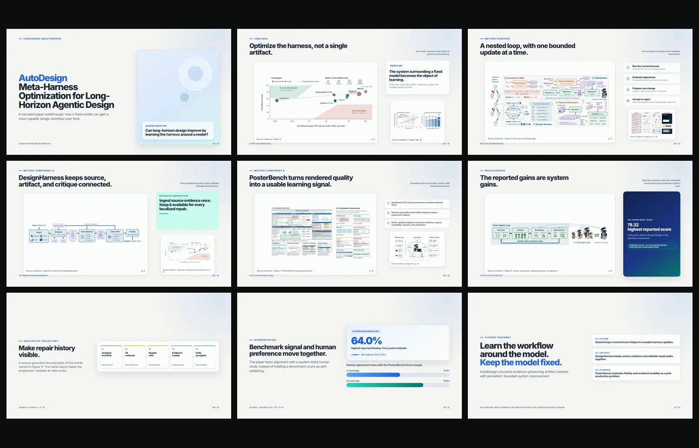</a><br>
      <strong>Video · AutoDesign</strong><br>
      A six-minute 1080p conference video introducing Meta-Harness Optimization, DesignHarness, and PosterBench.<br>
      <a href="./assets/readme/demo/artifacts/autodesign-conference-video-6min.mp4"><strong>Watch MP4 ↗</strong></a>
    </td>
  </tr>
</table>

<a id="agent-skills"></a>

##  Agent Skills · Use AutoDesign without the server

Install the standalone Poster, PPT, Webpage, or Video Skill directly in Codex,
Claude Code, or DeepSeek Harness. Each Skill carries its own lightweight local
harness and keeps editable artifacts, evidence, attempts, and review state in
your chosen output directory—no AutoDesign application server required.

Poster is the first Skill to receive the new Agent-first v2 workflow: the host
agent can inspect the paper PDF, request deterministic crops, review the source
catalog, and repair the correct workflow stage while a read-only browser audit
checks both screen and print output. [See what changed →](./agent_skills/README.md#poster-agent-first-v2)

[Open the Agent Skills install guide →](./agent_skills/README.md)

<a id="quickstart"></a>

##  Start locally

###  One-command local launch

Prerequisites: Node.js 22+ and `ffmpeg`/`ffprobe`.

```bash
curl -fsSL https://designanything.ai/install.sh | bash
autodesign start
```

The launcher installs under `~/.local/share/autodesign`, keeps state under
`~/.autodesign`, serves the bundled `web/dist`, and opens a browser. Run
`autodesign doctor` to check the installed runtime. Existing
`~/.designanything` state is migrated with a compatibility symlink. If the
hosted endpoint is unavailable, use the source setup below.

###  Build from source

Requirements: Python 3.10+, [`uv`](https://docs.astral.sh/uv/), Node.js 22+,
npm, and `ffmpeg`/`ffprobe` for Video.

#### 1. Install

```bash
uv sync
uv run python scripts/install_playwright_browsers.py
cd runtime/video && npm ci --omit=dev
cd ../../web && npm install
```

Configure provider keys in `.env` or enter them in the Web UI Settings drawer.
Do not replace an existing `.env` during an update.

#### 2. Launch the workbench

Start the backend:

```bash
uv run uvicorn scripts.web_server:app --reload --port 8000
```

In another terminal, start the frontend:

```bash
cd web
npm run dev
```

Open [localhost:5173](http://localhost:5173). Backend health is available at
[`/api/health`](http://127.0.0.1:8000/api/health).

Upload one PDF and choose **Paper All-in-One** to launch the poster, slides,
webpage, and narrated-video tracks together.

#### 3. Generate a paper poster

```bash
uv --cache-dir .uv-cache run python -m autodesign run \
  "Create a dense academic conference poster from the attached paper." \
  --from-file /absolute/path/to/paper.pdf \
  --template cvpr-landscape
```

Inspect `final/poster.html`, `final/preview.png`, the final manifest, and
`run_events.jsonl`. A file can exist after a fallback, so terminal status and
validation feedback remain part of the result.

<details>
<summary><strong>Use a visual reference</strong></summary>

```bash
uv --cache-dir .uv-cache run python -m autodesign run \
  "Create a paper poster using the reference's visual system." \
  --from-file /absolute/path/to/paper.pdf \
  --reference-poster /absolute/path/to/reference.png
```

Reference posters transfer visual systems only. Their text, claims, logos, QR
codes, figures, tables, and links never become paper evidence.

</details>

<a id="paper-suite"></a>

##  One paper. Every artifact you need next.

<p align="center">
  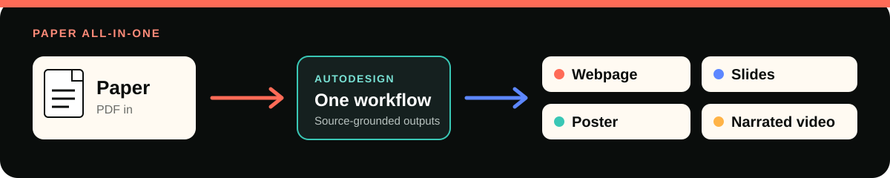
</p>

Finish the paper once. **Paper All-in-One** packages the same source into
everything that usually comes next: a promotional webpage, conference slides,
an academic poster, and a narrated video with timed subtitles. No need to
rebuild the paper's story for each format.

<p align="center">
  <a href="https://designanything.ai/"><strong>Generate the complete paper suite ↗</strong></a>
</p>

##  Watch AutoDesign in action

Follow a guided local walkthrough: configure the Workbench, launch Paper
All-in-One, inspect the run, and enter each editable canvas. You can also try
the [online demo](https://designanything.ai/) in your browser; for the complete,
most reliable experience, we recommend installing AutoDesign locally.

<p align="center">
  <strong>Guided local walkthrough · Paper All-in-One → editable canvases</strong>
</p>

https://github.com/user-attachments/assets/69c25973-fedf-4273-aa33-6bd3e409c692

<details>
<summary><strong>Open the academic poster wall</strong></summary>
<br>

<p align="center"><strong>Claude 4.8 authoring route</strong></p>

<p align="center">
  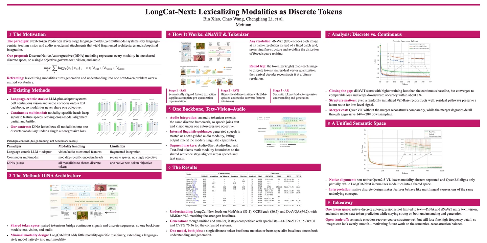
  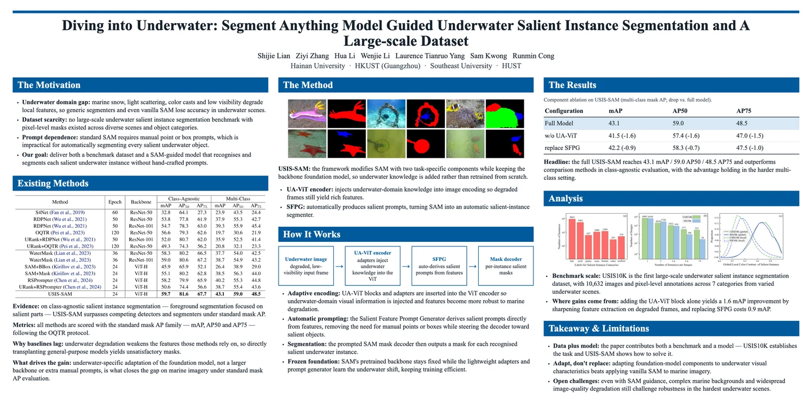
  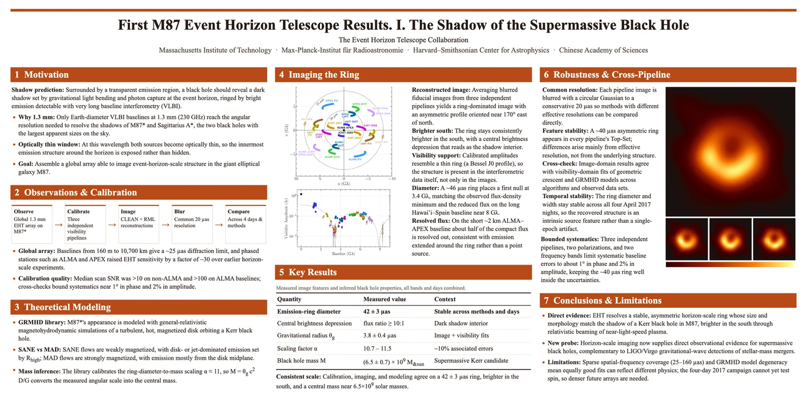
</p>

<p align="center"><strong>Codex GPT-5.5 xhigh authoring route</strong></p>

<p align="center">
  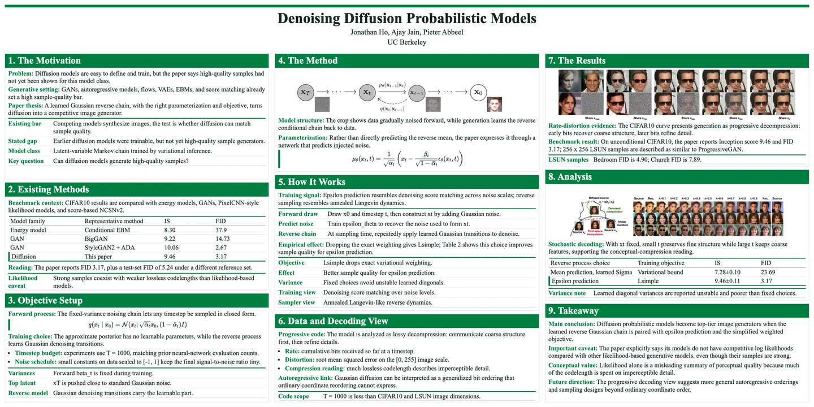
  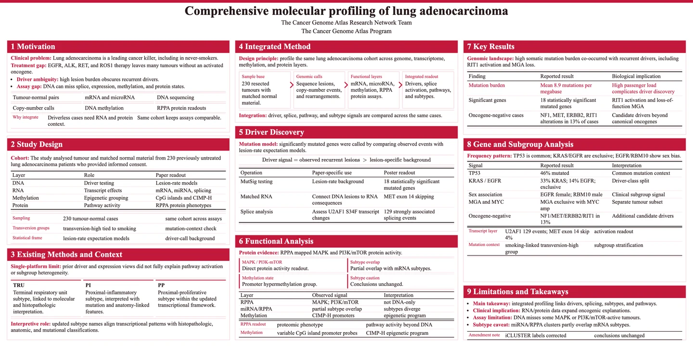
  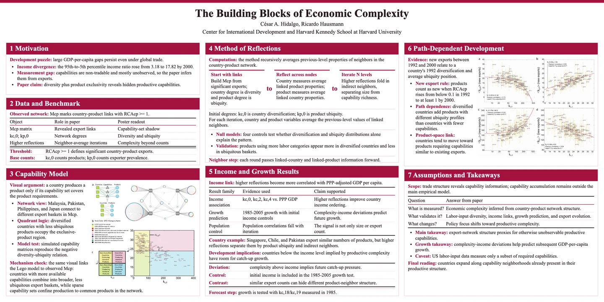
</p>

</details>

##  Why AutoDesign

- **The whole paper journey, in one workflow.** Build the promotional webpage,
  talk deck, conference poster, and narrated + captioned video from the same
  source instead of restarting four times.
- **Editable by default.** HTML, native text, tables, and named assets remain
  available for revision instead of being flattened into one image.
- **Source-grounded.** Claims, figures, and tables retain provenance beside the
  run; a reference can transfer style, never evidence.
- **Optimizes the system, not model weights.** Complete trajectories expose
  recurring failures, while meta-harness optimization improves one reusable
  DesignHarness component at a time.
- **Inspectable and local-first.** Events, manifests, candidates, validation
  feedback, and final files stay available on your machine.

<a id="methodology"></a>

##  Method: meta-harness optimization

A **design harness** is the system around a fixed LLM or MLLM that turns a
multimodal source into a human-facing artifact through an execution trajectory.
A **meta-harness** improves that surrounding system. AutoDesign therefore learns
from complete rollouts while keeping the underlying model weights fixed. Before
autonomous optimization, an evaluator coding agent uses human-annotated
reference artifacts across seven quality dimensions to implement a fixed
optimization-time evaluator. It combines rule-based checks with VLM judgments
and remains distinct from the frozen PosterBench protocol used for final system
comparison.

<p align="center">
  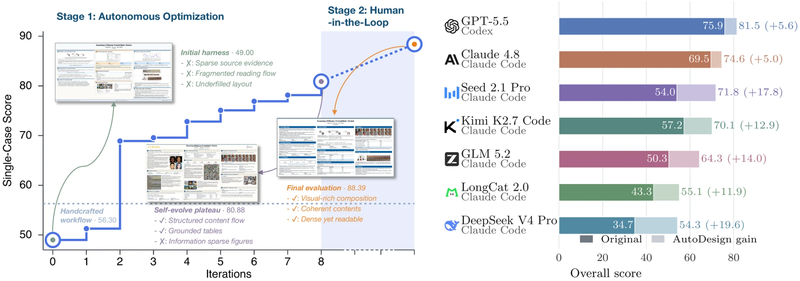
</p>

<p align="center">
  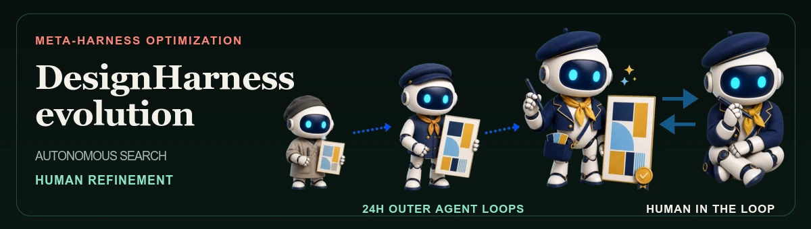
</p>

Autonomous outer-loop iterations evolve the harness through rollout,
evaluation, one-component update proposals, and acceptance. After autonomous
optimization reaches a plateau, optional Human-in-the-loop guidance can
redirect the search and further improve production poster quality.

###  Two nested feedback loops

| Loop | What it improves | Evidence and update |
|---|---|---|
| **Inner loop · artifact generation** | One editable artifact under a fixed design harness | A **Designer** revises the artifact; a **Critic** returns feedback; their interactions form an execution trajectory |
| **Outer loop · harness optimization** | The reusable design harness across tasks | The **MetaHarnessOptimizer** analyzes trajectories, evaluator scores, the persistent optimization record, and optional human guidance |

Every outer-loop iteration follows four stages: **rollout → evaluation → update
proposal → acceptance**. The optimizer acts as a planner and code editor,
updates exactly one harness component, and retains the candidate only when
training performance improves without reducing performance on an independent
development set. Development trajectories are hidden from the update proposer.

<p align="center">
  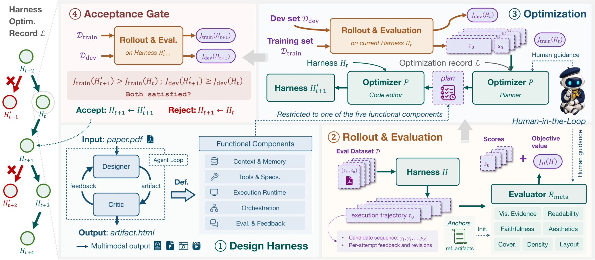
</p>

Human-in-the-loop guidance is optional. A user can give the planner
observations or high-level directions to redirect a stalled search; explicit
human input can also correct a systematic evaluator bias. Without guidance,
the outer loop runs autonomously.

###  Five design-harness components

| Component | Elements optimized by the meta-harness |
|---|---|
| **Context and Memory** | Multimodal source management, task prompts, skills, reusable assets, and persistent revision state |
| **Tools and Specifications** | Tools and editable-artifact specifications for layout, typography, and provenance |
| **Execution Runtime** | The workspace and runtime for authoring, rendering, validating, and exporting |
| **Orchestration** | Task routing, attempt budgets, loop control, candidate selection, fallback, and finalization |
| **Evaluation and Feedback** | Rule-based validation, model-based critique, and localized revision feedback |

###  The optimized DesignHarness

Meta-harness optimization yields **DesignHarness**, the reusable
artifact-producing system. Its four stages are **source ingestion**, **iterative
artifact generation and revision**, **validation with dual critics**, and
**finalization**. Paper metadata, claims, figures, tables, and source locations
become provenance-aware context; a coding-agent Designer edits native HTML; a
rule-based validator and VLM critic return localized feedback; and the best
valid candidate is made self-contained for delivery.

The current implementation permits up to 12 refinement attempts. Blocking
checks cover unsafe or missing assets, broken provenance, severe overflow or
overlap, and required typography or layout constraints. If no candidate passes
within the budget, the retained attempt history supports a constrained fallback
before the same finalization stage.

<p align="center">
  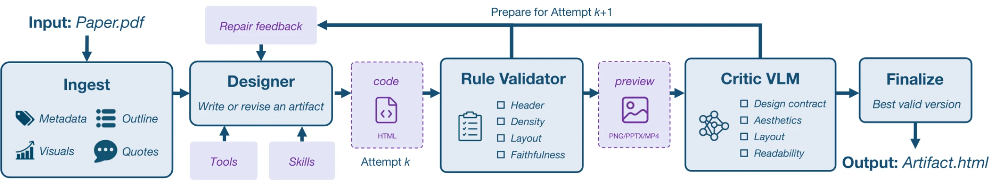
</p>

<p align="center">
  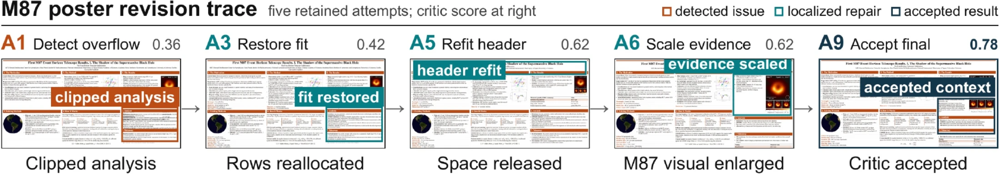
</p>

The latest paper traces one poster run through five selected attempts. The
critic identifies a clipped analysis lane at A1; A3 restores the fit, A5 refits
the header, A6 rescales evidence, and A9 preserves the repaired composition and
is accepted. The trajectory shows that diagnostics drive localized edits while
valid layout and source-derived content survive across revisions.

<a id="benchmark"></a>

##  PosterBench leaderboard

**PosterBench** evaluates a 100-paper large set and a fixed 10-paper small set
across AI/ML, biomedicine and health, climate and earth environment, economics
and policy, and physics and astronomy. Every output is rendered to a common
poster format before scoring.

The metadata-only manifests are released on Hugging Face as
[`YaxinLuo/PosterBench`](https://huggingface.co/datasets/YaxinLuo/PosterBench)
and
[`YaxinLuo/PosterBench-mini`](https://huggingface.co/datasets/YaxinLuo/PosterBench-mini).
They can be downloaded or loaded directly with `datasets` without
redistributing the underlying paper PDFs.

The seven dimensions are **Faithfulness, Coverage, Density, Visual Evidence,
Layout, Readability, and Aesthetics**, weighted
**10/10/15/10/20/25/10**. Programmatic evidence and source-conditioned VLM
judgments are aggregated first; then the strictest active ceiling for severe
layout damage, insufficient presentation viability, confirmed visible failure,
or protected render integrity is applied to each poster.

<p align="center">
  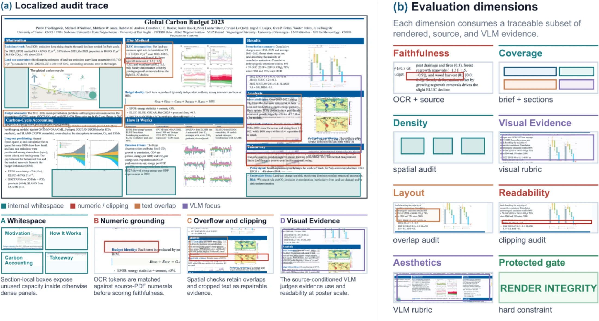
</p>

###  Full-Scale Benchmark Main Track · 100 papers

AutoDesign achieves the two highest PosterBench Scores. With Claude Code and
Claude 4.8 fixed, it scores **78.32**, exceeding Claude Design by **7.45**
points and OpenDesign by **8.87** points.

<p align="center">
  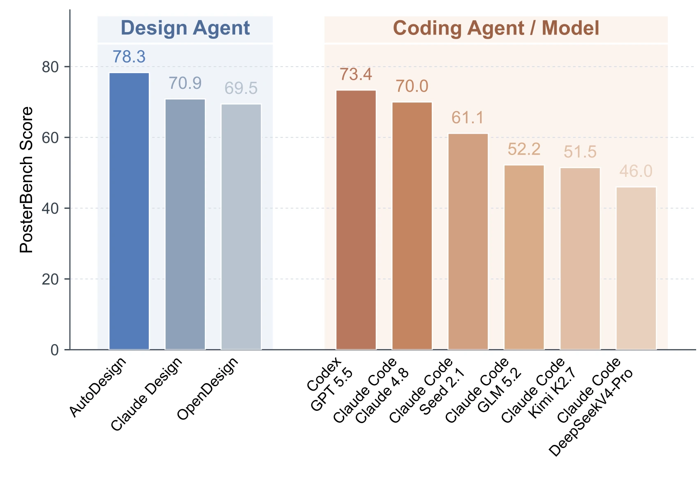
</p>

| Rank | Score | System | Design harness | Coding agent | Model |
|---:|---:|---|---|---|---|
| **1** | **78.32** | **AutoDesign** | **DesignHarness** | **Claude Code** | **Claude 4.8** |
| **2** | **77.97** | **AutoDesign** | **DesignHarness** | **Codex** | **GPT-5.5** |
| 3 | 73.37 | Codex | — | Codex | GPT-5.5 |
| 4 | 70.87 | Claude Design | Claude Design | Claude Code | Claude 4.8 |
| 5 | 70.01 | Claude Code | — | Claude Code | Claude 4.8 |
| 6 | 69.45 | OpenDesign | OpenDesign | Claude Code | Claude 4.8 |
| 7 | 62.17 | OpenDesign | OpenDesign | Codex | GPT-5.5 |
| 8 | 61.14 | Doubao | — | Claude Code | Seed 2.1 |
| 9 | 56.71 | PosterGen | — | — | Claude 4.8 |
| 10 | 52.22 | GLM | — | Claude Code | GLM 5.2 |
| 11 | 51.46 | Kimi | — | Claude Code | Kimi K2.7 |
| 12 | 49.09 | Any2Poster | — | — | Claude 4.8 |
| 13 | 46.01 | DeepSeek | — | Claude Code | DeepSeek V4 Pro |
| 14 | 44.61 | Paper2Poster | — | — | Claude 4.8 |

<details>
<summary><strong>Open the Small-Scale Benchmark Main Track · fixed 10-paper subset</strong></summary>
<br>

| Rank | Score | System | Design harness | Coding agent | Model |
|---:|---:|---|---|---|---|
| **1** | **81.46** | **AutoDesign** | **DesignHarness** | **Codex** | **GPT-5.5** |
| 2 | 75.87 | Codex | — | Codex | GPT-5.5 |
| **3** | **74.56** | **AutoDesign** | **DesignHarness** | **Claude Code** | **Claude 4.8** |
| 4 | 70.36 | OpenDesign | OpenDesign | Claude Code | Claude 4.8 |
| 5 | 69.55 | Claude Code | — | Claude Code | Claude 4.8 |
| 6 | 66.83 | Claude Design | Claude Design | Claude Code | Claude 4.8 |
| 7 | 60.58 | OpenDesign | OpenDesign | Codex | GPT-5.5 |
| 8 | 57.20 | Kimi | — | Claude Code | Kimi K2.7 |
| 9 | 54.01 | Doubao | — | Claude Code | Seed 2.1 |
| 10 | 51.82 | PosterGen | — | — | Claude 4.8 |
| 11 | 50.32 | GLM | — | Claude Code | GLM 5.2 |
| 12 | 46.88 | Any2Poster | — | — | Claude 4.8 |
| 13 | 42.06 | Paper2Poster | — | — | Claude 4.8 |
| 14 | 34.73 | DeepSeek | — | Claude Code | DeepSeek V4 Pro |

</details>

###  Controlled tracks · fixed 10-paper subset

Each controlled track varies one factor while holding the others fixed.

| Rank | Design Harness Track<br><sub>Fixed: Claude Code + Claude 4.8</sub> | Score | Coding Harness Track<br><sub>Fixed: AutoDesign + GLM 5.2</sub> | Score | Model Track<br><sub>Fixed: AutoDesign + Claude Code</sub> | Score |
|---:|---|---:|---|---:|---|---:|
| **1** | **AutoDesign** | **74.56** | **Kimi Code** | **82.31** | **Claude 4.8** | **74.56** |
| 2 | OpenDesign | 70.36 | ZCode | 69.53 | Seed 2.1 Pro | 71.83 |
| 3 | Claude Design | 66.83 | OpenCode | 67.87 | Kimi K2.7 | 70.12 |
| 4 | — | — | Claude Code | 64.33 | GLM 5.2 | 64.33 |
| 5 | — | — | — | — | LongCat 2.0 | 55.13 |
| 6 | — | — | — | — | DeepSeek V4 Pro | 54.29 |

###  DesignHarness benefit

Across seven matched model–coding-agent configurations, attaching DesignHarness
improves every PosterBench Score by **+5.01 to +19.56 points**. Native
Codex–GPT-5.5 rises from **75.87 to 81.46 (+5.59)**; Claude Code–Kimi K2.7
rises from **57.20 to 70.12 (+12.92)**; and the largest gain is
**+19.56** for Claude Code–DeepSeek V4 Pro.

<p align="center">
  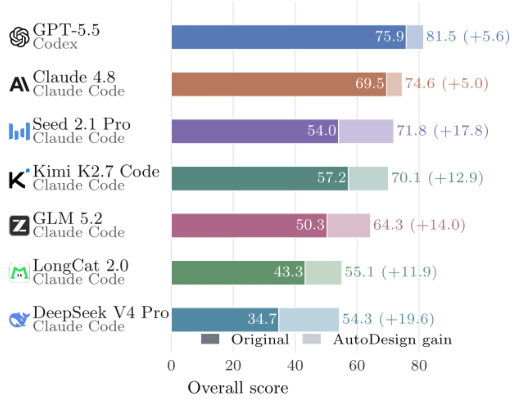
</p>

###  Cost–performance trade-off

On the fixed 10-paper subset, the observed Pareto frontier runs from LongCat 2.0
(**55.13 at $0.27/poster**) through Doubao Seed 2.1 Pro
(**71.83 at $2.75**) and Claude 4.8 (**74.56 at $7.63**) to GPT-5.5
(**81.46 at $10.02**). Doubao reaches 88% of the GPT-5.5 score at 27%
of its normalized designer-only API cost.

<p align="center">
  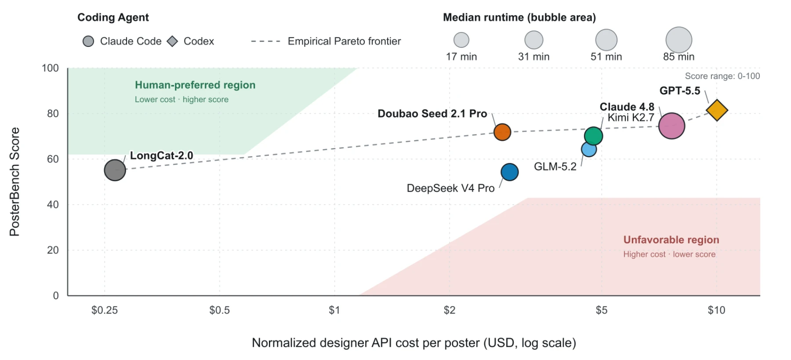
</p>

For the executable protocol, data preparation, score ownership, record-level
ceilings, and reproduction commands, see the
[PosterBench evaluation guide](eval/README.md).

<a id="human-evaluation"></a>

##  Human evaluation

The fully system-blind study collected **936 responses** from **11 volunteer
reviewers**: 933 ranking judgments and three skips. AutoDesign has the highest
Bradley–Terry estimate at **64.0%**, with a **55.2–77.8%** 95% interval. Its
tie-adjusted empirical preference is 61.3% against Claude Code, 63.1% against
OpenDesign, and 67.6% against Claude Design.

<p align="center">
  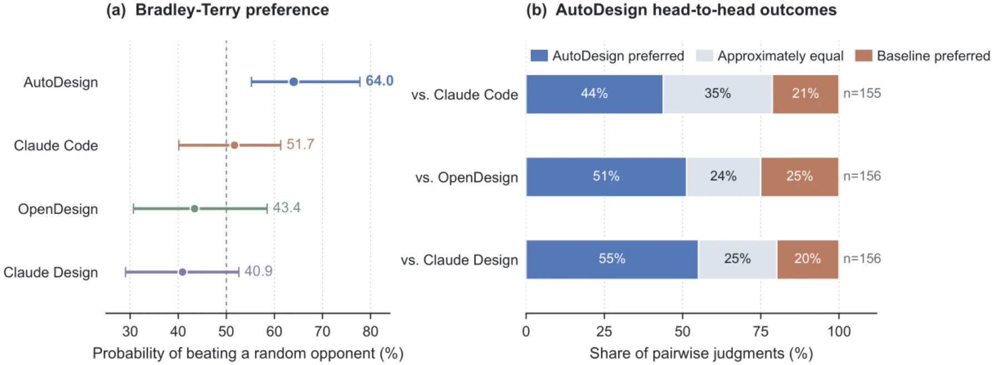
</p>

PosterBench is positively, though imperfectly, associated with human preference
(**r = 0.34**, 95% interval **0.22–0.44**). Agreement with the
PosterBench-preferred poster rises from **51.9%** for 0–3-point gaps to
**74.4%** when the score gap is at least 20 points.

<p align="center">
  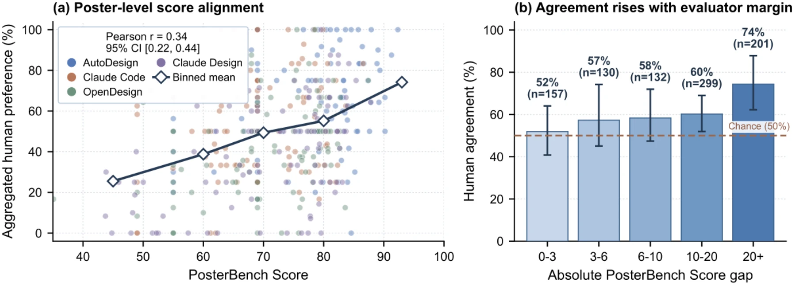
</p>

##  Future directions

The current DesignHarness already produces pilot **paper-to-slide,
paper-to-webpage, and paper-to-conference-video** artifacts, but PosterBench
formally validates academic posters only. Slides, webpages, and videos still
need medium-specific source–output data, evaluators, rendering and validation
gates, and communication objectives before their research claims match the
poster pipeline.

<p align="center">
  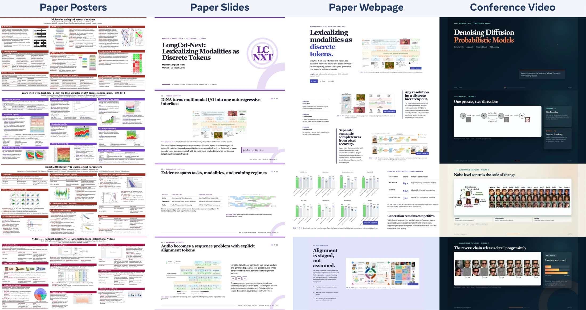
</p>

Longer term, AutoDesign aims toward multimodal-in, multimodal-out agentic design:
integrating papers, visual evidence, code, data, and human guidance to create
medium-specific outputs. Open research problems include better component
selection, evaluator evolution anchored by frozen tasks and human audits, and
combining harness optimization with model post-training.

<p align="center">
  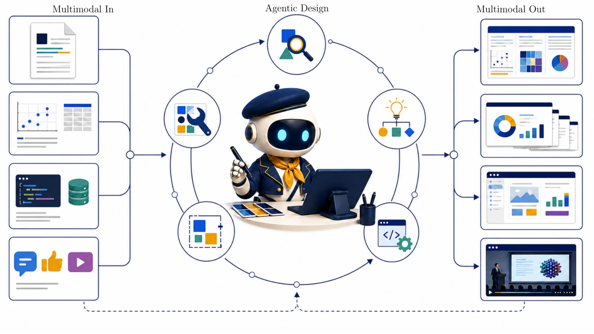
</p>

We welcome researchers, designers, and engineers to contribute new design
harnesses, refinement workflows, evaluators, and artifact capabilities.

<p align="center">
  <a href="https://github.com/Yaxin9Luo/AutoDesign"><strong>Contribute on GitHub ↗</strong></a> ·
  <a href="https://autodesign.designanything.ai/"><strong>Explore the project ↗</strong></a>
</p>

<a id="interfaces"></a>

##  Interfaces and outputs

The Web UI provides Paper All-in-One generation, model and provider settings,
progress streaming, cancel and retry, server-backed history, and direct editing
for supported HTML-first artifacts.

Start the interactive CLI with:

```bash
uv --cache-dir .uv-cache run python -m autodesign
```

| Use case | Primary output |
|---|---|
| Academic paper poster | `final/poster.html`, `final/preview.png`, optional PDF |
| Slide deck | `final/deck.html`, `final/deck.pdf`, slide previews |
| Landing or project page | `final/index.html`, `final/preview.png` |
| Video | Editable HyperFrames project, narrated MP4 with AAC audio, transcript, and timed SRT/VTT subtitles |
| Creative poster | HTML/PNG, with legacy PSD/SVG paths where supported |
| Research reproduction handoff | OpenResearch project, session, and report links |

Single-run output lives under `out/runs/<run_id>/`; EvaData batch output lives
under `out/eva_poster_batches/<batch_id>/`. Both locations are ignored by Git.

The canonical Python module and installed launcher are `autodesign`. The
`design_anything` module, `design-anything` console command, `designanything`
launcher, and `DESIGN_ANYTHING_*` environment variables are deprecated
compatibility aliases. New configuration and automation should use
`AUTODESIGN_*`.

##  Acknowledgements

AutoDesign is made possible by the open-source community. We are especially
grateful to:

- [HyperFrames](https://github.com/heygen-com/hyperframes) for the HTML-first
  video runtime, composition linting, and MP4 rendering.
- [KaTeX](https://katex.org/) for offline mathematical typesetting in portable
  HTML artifacts.
- [html-ppt-skill](https://github.com/lewislulu/html-ppt-skill) for the
  MIT-licensed deck-authoring reference assets adapted in this repository.

##  License

MIT. Bundled third-party assets retain their own licenses; see
[Third-Party Notices](./THIRD_PARTY_NOTICES.md) for details.
