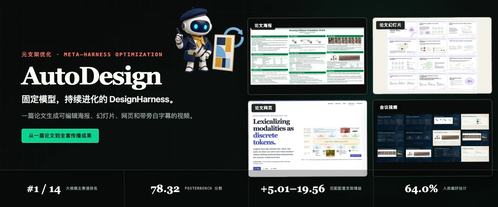
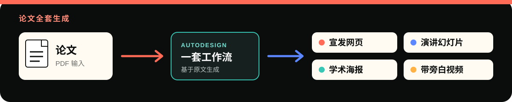

<p align="center">
  <a href="./README.md">English</a> ·
  <strong>简体中文</strong> ·
  <a href="./README.ko.md">한국어</a>
</p>

### 动态

| 日期 | 更新 |
| :--- | :--- |
| **2026-08-18** | [Poster Skill Agent-first v2：直接理解 PDF、可追溯多轮修订与只读 DOM QA](./agent_skills/README.zh-CN.md#poster-agent-first-v2) |
| **2026-08-17** | [可独立安装的 Poster、PPT、Webpage 与 Video Agent Skills 现已发布](./agent_skills/README.zh-CN.md) |
| **2026-08-15** | [正式支持 DeepSeek Harness 作为 Coding Agent](https://github.com/Yaxin9Luo/AutoDesign/pull/2) |
| **2026-08-14** | [首次公开发布](https://github.com/Yaxin9Luo/AutoDesign/commit/55586f66fa4a126997f0d252e070701c4ae68920) |

<p align="center">
  
</p>

<h1 align="center">AutoDesign: Meta-Harness Optimization for Long-Horizon Agentic Design</h1>

<p align="center">
  围绕固定模型学习可复用的 DesignHarness，再把一篇论文变成可编辑的海报、幻灯片、网页和带旁白字幕的视频。
</p>

<p align="center">
  <a href="https://arxiv.org/abs/2608.13560"><kbd>论文 · arXiv:2608.13560 ↗</kbd></a>
  &nbsp;&nbsp;·&nbsp;&nbsp;
  <a href="https://huggingface.co/datasets/YaxinLuo/PosterBench"><kbd>数据集 · PosterBench ↗</kbd></a>
  &nbsp;&nbsp;·&nbsp;&nbsp;
  <a href="https://huggingface.co/datasets/YaxinLuo/PosterBench-mini"><kbd>数据集 · PosterBench-mini ↗</kbd></a>
</p>

<p align="center">
  <a href="https://autodesign.designanything.ai/"><strong>✦ 探索 AutoDesign 的完整故事 ↗</strong></a>
  &nbsp;&nbsp;·&nbsp;&nbsp;
  <a href="https://designanything.ai/"><strong>打开演示页面 ↗</strong></a>
</p>

<p align="center">
  <a href="#user-content-demos"><strong>Demo</strong></a> ·
  <a href="#user-content-agent-skills">Agent Skills</a> ·
  <a href="#user-content-quickstart">快速开始</a> ·
  <a href="#user-content-paper-suite">论文套件</a> ·
  <a href="#user-content-methodology">方法</a> ·
  <a href="#user-content-benchmark">PosterBench</a> ·
  <a href="#user-content-human-evaluation">人类评测</a> ·
  <a href="#user-content-interfaces">输出</a>
</p>

<a id="demos"></a>

##  AutoDesign for AutoDesign · 一篇论文 → 四种成果

以下均为真实成果，不是效果图。AutoDesign 直接把自己的论文生成了论文 Figure 2
海报、24 页正式学术报告、完整的编辑式研究网页，以及一段六分钟 1080p 会议视频。

<table width="100%">
  <tr>
    <td width="50%" valign="top">
      <a href="./assets/readme/demo/artifacts/autodesign-for-autodesign-poster.pdf"></a><br>
      <strong>海报 · AutoDesign</strong><br>
      论文 Figure 2：由 AutoDesign 为自身系统生成的一张信息密集、可编辑的学术海报。<br>
      <a href="./assets/readme/demo/artifacts/autodesign-for-autodesign-poster.pdf"><strong>打开完整海报 PDF ↗</strong></a>
    </td>
    <td width="50%" valign="top">
      <a href="./assets/readme/demo/artifacts/autodesign-slides-formal-academic.pdf"></a><br>
      <strong>幻灯片 · AutoDesign</strong><br>
      一套完整的 24 页正式学术会议演示文稿，由 AutoDesign 为自身系统生成。<br>
      <a href="./assets/readme/demo/artifacts/autodesign-slides-formal-academic.pdf"><strong>打开完整幻灯片 PDF ↗</strong></a>
    </td>
  </tr>
  <tr>
    <td width="50%" valign="top">
      <a href="./assets/readme/demo/artifacts/autodesign-landing-page.html"></a><br>
      <strong>网页 · AutoDesign</strong><br>
      把论文的方法、证据、结果与局限组织成可交互阅读体验的编辑式研究页面。<br>
      <a href="./assets/readme/demo/artifacts/autodesign-landing-page.html"><strong>下载完整落地页 ↗</strong></a>
    </td>
    <td width="50%" valign="top">
      <a href="./assets/readme/demo/artifacts/autodesign-conference-video-6min.mp4"></a><br>
      <strong>视频 · AutoDesign</strong><br>
      一段六分钟 1080p 会议视频，概览 Meta-Harness Optimization、DesignHarness 与 PosterBench。<br>
      <a href="./assets/readme/demo/artifacts/autodesign-conference-video-6min.mp4"><strong>观看 MP4 ↗</strong></a>
    </td>
  </tr>
</table>

<a id="agent-skills"></a>

##  Agent Skills · 无需服务器也能使用 AutoDesign

可将独立的 Poster、PPT、Webpage 或 Video Skill 直接安装到 Codex、Claude Code
或 DeepSeek Harness。每个 Skill 都带有轻量级本地 harness，并将可编辑成果、证据、
多轮尝试和评审状态保存在用户指定的输出目录中，无需运行 AutoDesign 应用服务器。

Poster 是第一个接入 Agent-first v2 工作流的 Skill：宿主 Agent 可以直接检查论文 PDF、
请求确定性裁图、评审来源目录，并根据失败原因回到正确阶段修复；只读浏览器审计会同时
检查屏幕与打印结果。[查看本次具体提升 →](./agent_skills/README.zh-CN.md#poster-agent-first-v2)

[打开 Agent Skills 中文安装指南 →](./agent_skills/README.zh-CN.md)

<a id="quickstart"></a>

##  本地运行

###  一条命令启动本地版本

前置要求：Node.js 22+，以及 `ffmpeg`/`ffprobe`。

```bash
curl -fsSL https://designanything.ai/install.sh | bash
autodesign start
```

启动器安装在 `~/.local/share/autodesign`，状态保存在 `~/.autodesign`，并通过打包后的 `web/dist` 提供服务、自动打开浏览器。运行 `autodesign doctor` 可以检查已安装的运行环境。已有的 `~/.designanything` 状态会通过兼容软链接迁移。如果托管端点暂不可用，请使用下面的源码运行方式。

###  从源码运行

环境要求：Python 3.10+、[`uv`](https://docs.astral.sh/uv/)、Node.js 22+、
npm，以及视频生成所需的 `ffmpeg`/`ffprobe`。

#### 1. 安装

```bash
uv sync
uv run python scripts/install_playwright_browsers.py
cd runtime/video && npm ci --omit=dev
cd ../../web && npm install
```

在 `.env` 中配置服务商密钥，或在 Web UI 的设置抽屉中填写。更新时不要覆盖已有的 `.env`。

#### 2. 启动工作台

启动后端：

```bash
uv run uvicorn scripts.web_server:app --reload --port 8000
```

在另一个终端中启动前端：

```bash
cd web
npm run dev
```

打开 [localhost:5173](http://localhost:5173)。后端健康状态位于 [`/api/health`](http://127.0.0.1:8000/api/health)。

上传一份 PDF，然后选择 **Paper All-in-One**，即可同时启动海报、幻灯片、网页和旁白视频四条生成路线。

#### 3. 生成论文海报

```bash
uv --cache-dir .uv-cache run python -m autodesign run \
  "Create a dense academic conference poster from the attached paper." \
  --from-file /absolute/path/to/paper.pdf \
  --template cvpr-landscape
```

检查 `final/poster.html`、`final/preview.png`、最终 Manifest 和 `run_events.jsonl`。失败后的回退流程也可能产生文件，因此还需要结合终止状态与验证反馈判断结果。

<details>
<summary><strong>使用视觉参考图</strong></summary>

```bash
uv --cache-dir .uv-cache run python -m autodesign run \
  "Create a paper poster using the reference's visual system." \
  --from-file /absolute/path/to/paper.pdf \
  --reference-poster /absolute/path/to/reference.png
```

参考海报只迁移视觉系统。参考图中的文字、论点、Logo、二维码、图片、表格和链接绝不会成为目标论文的证据。

</details>

<a id="paper-suite"></a>

##  一篇论文，生成之后所需的一切

<p align="center">
  
</p>

论文只需写一次。**Paper All-in-One** 会以同一份原文为基础，打包生成接下来通常需要的全部成果：宣发网页、参会幻灯片、学术海报，以及带定时字幕的旁白视频。不必再为每一种形式从头重讲论文故事。

<p align="center">
  <a href="https://designanything.ai/"><strong>生成完整论文传播套件 ↗</strong></a>
</p>

##  观看 AutoDesign 实际运行

观看本地操作导览：配置 Workbench、启动 Paper All-in-One、查看运行过程，并进入每个
可编辑画布。你也可以先在[在线 Demo](https://designanything.ai/) 中体验。若要获得最完整、
最稳定的使用体验，我们建议本地安装 AutoDesign。

<p align="center">
  <strong>本地操作导览 · Paper All-in-One → 可编辑画布</strong>
</p>

https://github.com/user-attachments/assets/69c25973-fedf-4273-aa33-6bd3e409c692

<details>
<summary><strong>展开学术海报墙</strong></summary>
<br>

<p align="center"><strong>Claude 4.8 创作路线</strong></p>

<p align="center">
  
  
  
</p>

<p align="center"><strong>Codex GPT-5.5 xhigh 创作路线</strong></p>

<p align="center">
  
  
  
</p>

</details>

##  为什么选择 AutoDesign

- **论文后续的整段旅程，一套工作流完成。** 基于同一份原文生成宣发网页、演讲幻灯片、会议海报和带旁白字幕的视频，不必重复开始四次。
- **默认可编辑。** HTML、原生文本、表格和具名资源都可以继续修改，而不是被压平成一张图片。
- **基于原文。** 论点、图片和表格的来源随运行结果保留；参考图只能迁移风格，不能成为内容证据。
- **优化系统，而不是修改模型权重。** 完整执行轨迹能暴露反复出现的问题，元支架优化每次改进一个可复用的 DesignHarness 组件。
- **可检查，本地优先。** 事件、Manifest、候选版本、验证反馈和最终文件都保留在你的机器上。

<a id="methodology"></a>

##  方法：元支架优化

**设计支架（design harness）** 是固定 LLM 或 MLLM 周围的系统，它通过执行轨迹把多模态来源转化为面向人的成果。**元支架（meta-harness）** 则负责改进这套外围系统。因此，AutoDesign 从完整运行轨迹中学习，同时保持底层模型权重不变。在自主优化开始前，一个 evaluator coding agent 根据七个质量维度上的人工标注参考成果实现固定的优化期 evaluator。它结合规则检查与 VLM 判断，并与最终系统比较所使用的冻结 PosterBench 协议彼此独立。

<p align="center">
  
</p>

<p align="center">
  
</p>

自主外循环通过 rollout、evaluation、单组件更新提案和 acceptance 演化
DesignHarness。自主优化进入平台期后，可选 Human-in-the-loop 指引可以
重定向搜索，并进一步提升 production poster 质量。

###  两个嵌套反馈循环

| 循环 | 改进对象 | 证据与更新方式 |
|---|---|---|
| **内层循环 · 成果生成** | 固定设计支架下的单个可编辑成果 | **Designer** 修订成果，**Critic** 返回反馈；整个交互形成执行轨迹 |
| **外层循环 · 支架优化** | 跨任务复用的设计支架 | **MetaHarnessOptimizer** 分析执行轨迹、评估分数、持久化优化记录和可选人工指导 |

每次外层迭代都经过 **rollout → evaluation → update proposal → acceptance** 四个阶段。优化器依次承担 planner 和 code editor 的角色，每次只更新一个支架组件；只有当候选版本在训练集上提升、同时不降低独立 development set 的表现时，才会被保留。Development set 的轨迹不会暴露给更新提议器。

<p align="center">
  
</p>

Human-in-the-loop 指导是可选的。用户可以向 planner 提供观察或高层方向，让停滞的搜索转向；当评估器存在系统性偏差时，也只能通过显式人工输入进行修正。没有人工指导时，外层循环会自主运行。

###  设计支架的五类组件

| 组件 | 元支架优化的具体元素 |
|---|---|
| **Context and Memory** | 多模态来源管理、任务提示词、Skills、可复用资源，以及跨修订尝试保留的状态 |
| **Tools and Specifications** | 面向布局、字体与来源追踪的工具和可编辑成果规范 |
| **Execution Runtime** | 用于创作、渲染、验证和导出的工作区与运行时 |
| **Orchestration** | 任务路由、尝试预算、循环控制、候选选择、回退和最终化 |
| **Evaluation and Feedback** | 基于规则的验证、基于模型的评审，以及用于修订的局部反馈 |

###  优化后的 DesignHarness

元支架优化最终得到可复用的成果生产系统 **DesignHarness**。它包含四个阶段：**来源摄取、迭代生成与修订、双评审器验证、最终化**。论文元数据、论点、图片、表格和来源位置会被整理为可追溯上下文；coding-agent Designer 直接编辑原生 HTML；规则验证器和 VLM Critic 返回局部反馈；最终把最佳有效候选打包为可交付的自包含成果。

当前实现最多允许 12 次修订。阻断检查覆盖不安全或缺失资源、来源追踪断裂、严重溢出或重叠，以及必要的字体和布局约束。如果在预算内没有候选通过，系统会利用保留的尝试历史执行受约束的回退，再进入同一个最终化阶段。

<p align="center">
  
</p>

<p align="center">
  
</p>

最新论文还展示了一次海报运行中的五个代表性尝试。Critic 在 A1 发现分析区域被
裁切；A3 恢复整体适配，A5 重新调整页眉，A6 放大视觉证据，A9 保留修复后的
版式并被接受。这条轨迹表明，诊断会驱动局部编辑，同时让已经有效的布局和来自
原文的内容在后续修订中保持稳定。

<a id="benchmark"></a>

##  PosterBench 排行榜

**PosterBench** 包含 100 篇论文的大规模集合和固定的 10 篇论文小规模集合，覆盖 AI/ML、生物医学与健康、气候与地球环境、经济与政策、物理与天文五个学科。所有系统的输出都会先被渲染为统一海报格式再评分。

仅包含元数据的 benchmark manifest 已发布到 Hugging Face：
[`YaxinLuo/PosterBench`](https://huggingface.co/datasets/YaxinLuo/PosterBench)
和
[`YaxinLuo/PosterBench-mini`](https://huggingface.co/datasets/YaxinLuo/PosterBench-mini)。
用户可以直接下载或通过 `datasets` 加载，底层论文 PDF 不会被重新分发。

七个维度为 **Faithfulness、Coverage、Density、Visual Evidence、Layout、Readability、Aesthetics**，权重依次为 **10/10/15/10/20/25/10**。程序化证据与基于原文的 VLM 判断先完成聚合，然后对每张海报应用最严格的有效分数上限：严重布局损坏、展示可用性不足、已确认的可见失败，或受保护的渲染完整性。

<p align="center">
  
</p>

###  Full-Scale Benchmark Main Track · 100 篇论文

AutoDesign 获得 PosterBench 最高的两个分数。在 Claude Code 和 Claude 4.8 固定时，AutoDesign 得分 **78.32**，比 Claude Design 高 **7.45** 分，比 OpenDesign 高 **8.87** 分。

<p align="center">
  
</p>

| 排名 | 分数 | 系统 | Design harness | Coding agent | 模型 |
|---:|---:|---|---|---|---|
| **1** | **78.32** | **AutoDesign** | **DesignHarness** | **Claude Code** | **Claude 4.8** |
| **2** | **77.97** | **AutoDesign** | **DesignHarness** | **Codex** | **GPT-5.5** |
| 3 | 73.37 | Codex | — | Codex | GPT-5.5 |
| 4 | 70.87 | Claude Design | Claude Design | Claude Code | Claude 4.8 |
| 5 | 70.01 | Claude Code | — | Claude Code | Claude 4.8 |
| 6 | 69.45 | OpenDesign | OpenDesign | Claude Code | Claude 4.8 |
| 7 | 62.17 | OpenDesign | OpenDesign | Codex | GPT-5.5 |
| 8 | 61.14 | Doubao | — | Claude Code | Seed 2.1 |
| 9 | 56.71 | PosterGen | — | — | Claude 4.8 |
| 10 | 52.22 | GLM | — | Claude Code | GLM 5.2 |
| 11 | 51.46 | Kimi | — | Claude Code | Kimi K2.7 |
| 12 | 49.09 | Any2Poster | — | — | Claude 4.8 |
| 13 | 46.01 | DeepSeek | — | Claude Code | DeepSeek V4 Pro |
| 14 | 44.61 | Paper2Poster | — | — | Claude 4.8 |

<details>
<summary><strong>展开 Small-Scale Benchmark Main Track · 固定 10 篇论文子集</strong></summary>
<br>

| 排名 | 分数 | 系统 | Design harness | Coding agent | 模型 |
|---:|---:|---|---|---|---|
| **1** | **81.46** | **AutoDesign** | **DesignHarness** | **Codex** | **GPT-5.5** |
| 2 | 75.87 | Codex | — | Codex | GPT-5.5 |
| **3** | **74.56** | **AutoDesign** | **DesignHarness** | **Claude Code** | **Claude 4.8** |
| 4 | 70.36 | OpenDesign | OpenDesign | Claude Code | Claude 4.8 |
| 5 | 69.55 | Claude Code | — | Claude Code | Claude 4.8 |
| 6 | 66.83 | Claude Design | Claude Design | Claude Code | Claude 4.8 |
| 7 | 60.58 | OpenDesign | OpenDesign | Codex | GPT-5.5 |
| 8 | 57.20 | Kimi | — | Claude Code | Kimi K2.7 |
| 9 | 54.01 | Doubao | — | Claude Code | Seed 2.1 |
| 10 | 51.82 | PosterGen | — | — | Claude 4.8 |
| 11 | 50.32 | GLM | — | Claude Code | GLM 5.2 |
| 12 | 46.88 | Any2Poster | — | — | Claude 4.8 |
| 13 | 42.06 | Paper2Poster | — | — | Claude 4.8 |
| 14 | 34.73 | DeepSeek | — | Claude Code | DeepSeek V4 Pro |

</details>

###  受控 Track · 固定 10 篇论文子集

每个受控 Track 只改变一个因素，其他因素保持固定。

| 排名 | Design Harness Track<br><sub>固定：Claude Code + Claude 4.8</sub> | 分数 | Coding Harness Track<br><sub>固定：AutoDesign + GLM 5.2</sub> | 分数 | Model Track<br><sub>固定：AutoDesign + Claude Code</sub> | 分数 |
|---:|---|---:|---|---:|---|---:|
| **1** | **AutoDesign** | **74.56** | **Kimi Code** | **82.31** | **Claude 4.8** | **74.56** |
| 2 | OpenDesign | 70.36 | ZCode | 69.53 | Seed 2.1 Pro | 71.83 |
| 3 | Claude Design | 66.83 | OpenCode | 67.87 | Kimi K2.7 | 70.12 |
| 4 | — | — | Claude Code | 64.33 | GLM 5.2 | 64.33 |
| 5 | — | — | — | — | LongCat 2.0 | 55.13 |
| 6 | — | — | — | — | DeepSeek V4 Pro | 54.29 |

###  DesignHarness 增益

在七组模型与 coding agent 完全匹配的配置上，挂载 DesignHarness 后的 PosterBench Score 全部提高 **+5.01 至 +19.56 分**。原生 Codex–GPT-5.5 从 **75.87 提升至 81.46（+5.59）**；Claude Code–Kimi K2.7 从 **57.20 提升至 70.12（+12.92）**；最大增益是 Claude Code–DeepSeek V4 Pro 的 **+19.56**。

<p align="center">
  
</p>

###  成本—性能权衡

在固定 10 篇论文子集上，观测到的 Pareto 前沿从 LongCat 2.0（**55.13，$0.27/张**），经过 Doubao Seed 2.1 Pro（**71.83，$2.75**）和 Claude 4.8（**74.56，$7.63**），延伸到 GPT-5.5（**81.46，$10.02**）。Doubao 以 GPT-5.5 归一化 designer-only API 成本的 27%，达到其 88% 的分数。

<p align="center">
  
</p>

可执行协议、数据准备、评分归属、逐记录分数上限和复现命令详见 [PosterBench 评估指南](eval/README.zh-CN.md)。

<a id="human-evaluation"></a>

##  人类评测

完全隐藏系统身份的研究共收集 **11 位志愿评审者的 936 份回答**：933 次排序判断，3 次跳过。AutoDesign 的 Bradley–Terry 估计最高，为 **64.0%**，95% 区间为 **55.2–77.8%**。经过平局校正后，它对 Claude Code、OpenDesign 和 Claude Design 的经验偏好率分别为 61.3%、63.1% 和 67.6%。

<p align="center">
  
</p>

PosterBench 与人类偏好呈正相关，但并不完全等价（**r = 0.34**，95% 区间 **0.22–0.44**）。当分数差为 0–3 分时，人类与 PosterBench 偏好方向的一致率为 **51.9%**；当差距至少为 20 分时，一致率上升到 **74.4%**。

<p align="center">
  
</p>

##  未来方向

当前 DesignHarness 已经能够生成 **paper-to-slide、paper-to-webpage 和 paper-to-conference-video** 试验性成果，但 PosterBench 目前只正式验证学术海报。幻灯片、网页和视频仍需为各自媒介建立来源—输出数据、评估器、渲染与验证门，以及媒介特定的传播目标，才能达到与海报流程相同的研究验证强度。

<p align="center">
  
</p>

更长远的目标是实现 multimodal-in、multimodal-out 的智能体设计：综合论文、视觉证据、代码、数据与人工指导，生成适配不同媒介的成果。仍待研究的问题包括更好的组件选择、以冻结任务和人工审计为锚点的评估器演化，以及支架优化与模型后训练的结合。

<p align="center">
  
</p>

我们欢迎研究者、设计师和工程师贡献新的设计支架、精修工作流、评估器和成果能力。

<p align="center">
  <a href="https://github.com/Yaxin9Luo/AutoDesign"><strong>在 GitHub 上参与贡献 ↗</strong></a> ·
  <a href="https://autodesign.designanything.ai/"><strong>探索项目 ↗</strong></a>
</p>

<a id="interfaces"></a>

##  接口与输出

Web UI 提供 Paper All-in-One 生成、模型与服务商设置、进度流、取消与重试、服务端历史记录，以及对受支持 HTML-first 成果的直接编辑。

通过以下命令启动交互式 CLI：

```bash
uv --cache-dir .uv-cache run python -m autodesign
```

| 使用场景 | 主要输出 |
|---|---|
| 学术论文海报 | `final/poster.html`、`final/preview.png`、可选 PDF |
| 幻灯片 | `final/deck.html`、`final/deck.pdf`、幻灯片预览 |
| 落地页或项目网页 | `final/index.html`、`final/preview.png` |
| 视频 | 可编辑的 HyperFrames 项目、带 AAC 音频的旁白 MP4、逐字稿和定时 SRT/VTT 字幕 |
| 创意海报 | HTML/PNG；支持时沿用旧版 PSD/SVG 路径 |
| 研究复现交接 | OpenResearch 项目、Session 和报告链接 |

单次运行输出位于 `out/runs/<run_id>/`；EvaData 批处理输出位于 `out/eva_poster_batches/<batch_id>/`。这两个位置都被 Git 忽略。

正式的 Python 模块和安装后启动器名称是 `autodesign`。`design_anything` 模块、`design-anything` 控制台命令、`designanything` 启动器和 `DESIGN_ANYTHING_*` 环境变量均为已弃用的兼容别名。新配置和自动化应使用 `AUTODESIGN_*`。

##  致谢

AutoDesign 建立在开源社区长期积累的工作之上。我们特别感谢：

- [HyperFrames](https://github.com/heygen-com/hyperframes)：提供 HTML-first
  视频运行时、合成校验与 MP4 渲染。
- [KaTeX](https://katex.org/)：让可移植 HTML 成果能够离线排版数学公式。
- [html-ppt-skill](https://github.com/lewislulu/html-ppt-skill)：其 MIT
  许可的幻灯片创作参考资产被适配进本仓库。

##  许可证

MIT。仓库中包含的第三方素材保留其各自许可证；详情参见
[第三方许可说明](./THIRD_PARTY_NOTICES.md)。
